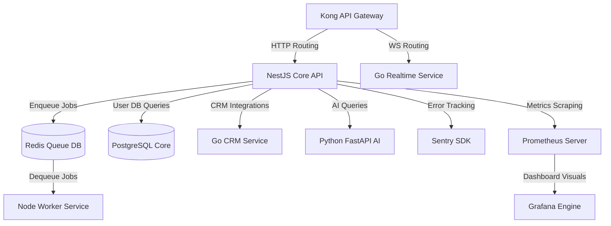

# BizSaathi Backend Documentation Hub

Welcome to the **BizSaathi** backend stack! This documentation repository provides full setup instructions, runbooks, and deployment guides for all systems across our production environment.

## System Architecture Overview

BizSaathi is structured as a premium microservices ecosystem. It features robust transaction APIs, real-time message broadcasting, backgrounds jobs processing, and AI integrations.

---

## 📂 Core Documentation Index

To get started with operating and maintaining BizSaathi in production, refer to the following documentation guides:

1. 🚀 **[Deployment Runbook](file:///c:/Users/arunk/Desktop/bizsaathi/docs/DEPLOYMENT.md)**: Detailed step-by-step guides for shipping the stack to production via Docker Compose, Railway, or AWS ECS Fargate.
2. 🚨 **[Operations Runbook](file:///c:/Users/arunk/Desktop/bizsaathi/docs/RUNBOOK.md)**: Actionable mitigation runbooks for operational incidents, database locks, queue pileups, memory leakage, or WhatsApp rate limiting.
3. 📦 **[Railway Setup Guide](file:///c:/Users/arunk/Desktop/bizsaathi/deploy/railway/README.md)**: Standard configuration mapping for Railway deployment.

---

## 🛠️ Tech Stack & Key Integrations

* **Core Framework**: NestJS (TypeScript) with customized exception filters and interceptors.
* **Database & ORM**: PostgreSQL & Prisma Client.
* **Queue Engine**: BullMQ on Redis.
* **Monitoring**: Prometheus scraping custom business metrics + Sentry Node SDK capturing exceptions (fully scrubbed of sensitive PII data).
* **Security & Hardening**: Helmet (configured with a strict Content Security Policy), CORS restrictions, and global JWT Guards with metadata-based route bypassing.
